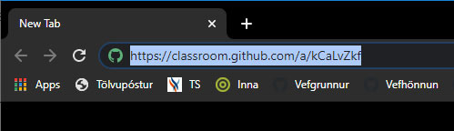
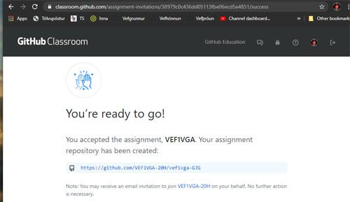

# Námsskipulag VEFÞ2VFC

### Inna 

* Verkefnalýsingar eru í Innu/Áfangi/Verkefni
* Í fyrstu verklýsingu áfangans er **þátttökubeiðni** (_Classroom invitation_) 
  * Þátttökubeiðnin er vefslóð (_url_) í **Athugasemdir kennara**. 
  * Afritaðu þáttökubeiðnina í vafra (_browser_)     
  * Eftir að hafa ýtt á "Enter" fer af stað ferli á Github miðlinum sem býr til áfangageymsluna þína	(_Classroom repository_) 
  
  * **Strax** eftir að hafa opnað áfangageymsluna skilar þú tengli (_link_) í **INNU - verkefni 1 - vefslóð (URL)** sem vísar á geymsluna þína. 
  * Kennari hefur fullan aðgang að geymslunni og getur aðstoðað þig beint í kóðanum ef þörf er á því. 
* Einkunn er gefin fyrir verkefnin í Innu að loknum skilafresti sem er tiltekinn í þar.

### Github áfangageymsla - _Classroom repository_

Áfangageymslan er aðeins aðgengileg einum nemanda (_Github user_) og kennara áfangans.

* Í áfangageymslunni eru möppur sem á að skila verkefnum í
* Þú getur búið til, breytt og eytt gögnum í áfangageymslunni en geymslan sjálf er eign Tækniskólans
* Nemendur geta hlaðið upp verkefnum (_upload files_) beint í verkefnamöppurnar en það er skynsamlegast að nota þær lausnir sem GIT og Github bjóða upp á. 
* Það er mikilvægt að nemendur vinni verkefnin sín í áfangageymslunni **til að sýna fram á eigið vinnuframlag**. 

### Yfirferð verkefna

* Kennari leiðréttir verkefni beint í áfangageymslu nemenda. 
* Einkunn er gefin fyrir verkefnin í Innu 

### Námsefni

Almennt lesefni og leiðbeiningar er birt á internetinu: 

* https://vefthroun.github.io 

#### Skjáfyrirlestrar (Youtube) 

* Github áfangageymsla (Classroom repository): https://youtu.be/PPwpF6yTX3Y

### Hugbúnaður

Hér er upptalning á hugbúnaði og forritum sem notuð eru í áfanganum. 
* Vefumsjón: [Github](https://github.com)
* Hýsing: [Heroku](https://https://heroku.com/)
* Hýsing: [Nýskráning - Heroku](https://https://signup.heroku.com/)
* Vefritunarforrit: [Visual Studio Code](https://code.visualstudio.com/). Nemendum er frjálst að nota önnur forrit ef þau skila sama árangri.

### Skráning Github reiknings

Það er viðbúið að öll námsaðstoð verði alfarið í gegnum áfangageymsluna og þá er mikilvægt að kennari geti séð hver er að senda beiðni um aðstoð (_request_) og geti ávarpað viðkomandi með nafni.  

* Við skráningu Github reiknings verður að koma **skýrt fram hver er eigandinn**. Kennari getur hafnað reikningi ef það er ekki gert
  * Dæmi um reikning sem _verður hafnað_: **Gollum** - The Hobbit Slayer
  * Dæmi um reikning sem er samþykktur: **gjg1801** - Guðmundur Jón Guðjónsson   (upphafstafir, afmælisdagur og í **Stillingar (_Settings_)** er skráð fullt nafn) 
  * Ef nemandi á reikning með óljósu heiti og getur ekki skipt um reikning með góðu móti, þá dugar að setja fullt nafn í  **Stillingar**, dæmi: **Gollum** - Guðmundur Jón Guðjónsson
  * Setjið prófílmynd sem sýnir skýrt hver eigandinn er
  * Dæmi um mynd sem verður hafnað   

### Vefþróun

Vefþróun er kennd í 4 áföngum á tölvubraut. Í fyrsta áfanga [VEFÞ1VG05AU](https://vefgrunnur.github.io/) er farið í grunnatriði vefsíðuhönnunar, í öðrum áfanga [VEFÞVH205BU](https://vefhonnun.github.io/) er farið í samsett skipulag vefs í vefþróunarumhverfi. Í þriðja áfanga VEF2VF05CU eru grunnatriði vefforritunar kynnt. Í fjórða áfanga VEF2VÞ05DU læra nemendur uppsetningu gagnvirkrar vefþjónustu (client/server).  Hægt er að skoða <a href="https://tskoli.github.io"> áfangayfirlit tölvubrautar hér</a> <small>(_Best er að skoða yfirlitið á tölvuskjá_)</small>.
